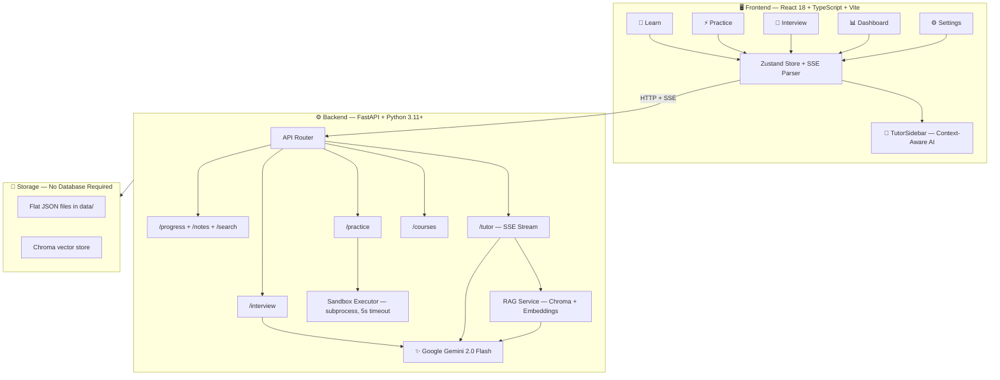

# 🧠 Ed-AI

<div align="center">

<!-- HERO BANNER — Replace with a real screenshot of the app dashboard -->
<!-- Recommended: 1280×640px or wider, PNG or WebP -->


<br/>
</div>

> *Your AI-Powered Technical Education Companion* Master DSA & programming through structured courses, a sandboxed code editor, spaced-repetition quizzes, and a streaming AI mock interviewer - all guided by a Socratic tutor that knows exactly what you're working on.

<br/>
<div align="center">

[](LICENSE)
[](https://www.python.org/)
[](https://react.dev/)
[](https://fastapi.tiangolo.com/)
[](https://www.typescriptlang.org/)

</div>

<br/>

---
## 📖 Table of Contents
- [Get Started](#-quick-start)
- [Features](#-features)
- [Docs](#-documentation)

---

## 📸 See it in Action

<div align="center">

<!-- Replace each src with your real screenshot path -->

| | |
|:---:|:---:|
|  |  |
| **📊 Dashboard** — Streak tracking, achievement badges, topic accuracy charts, and personalised recommendations | **📖 Learn** — Structured courses with progress bars, markdown lessons, and auto-saving notes |
|  |  |
| **⚡ Code Editor** — Monaco-powered split-pane editor with sandbox execution and test results | **🧠 AI Tutor** — Context-aware Socratic sidebar that knows your code, your progress, and your weak spots |
|  |  |
| **🎯 Mock Interview** — Streaming AI interviewer with voice input and structured debrief | **📝 MCQ Tests** — Topic-based quiz banks with explanations and spaced-repetition scheduling |

</div>

<br/>

---


## ✨ Features

<table>
<tr>
<td width="50%" valign="top">

### 📖 Structured Learning
- **14 courses** covering programming fundamentals through advanced DSA
- Markdown lessons with interactive MCQ checkpoints
- Auto-saving per-lesson notes with export support
- Progress tracking with visual completion indicators

</td>
<td width="50%" valign="top">

### ⚡ Coding Practice
- **Monaco Editor** — the same engine that powers VS Code
- Python 3 sandbox with 5-second timeout and import restrictions
- Test case runner with pass/fail indicators and diff output
- Problems organised by difficulty and topic

</td>
</tr>
<tr>
<td width="50%" valign="top">

### 🧠 Socratic AI Tutor
- **Context-aware** — knows your current page, code, failed tests, and progress
- **RAG-powered** — retrieves relevant course material via Chroma embeddings
- **Two modes**: _Guide Me_ (Socratic questioning) or _Direct_ (clear answers)
- Streams responses in real-time via SSE

</td>
<td width="50%" valign="top">

### 🎯 Mock Interviews
- **4 types**: Technical · System Design · HR · Behavioral
- **3 difficulty levels**: Easy · Medium · Hard
- Voice input with automatic transcription
- Structured AI debrief with score, strengths, and improvement areas

</td>
</tr>
<tr>
<td width="50%" valign="top">

### 📝 MCQ & Spaced Repetition
- **11 topic-based test banks** with detailed explanations
- **SM-2 algorithm** schedules review cards automatically
- Per-option incorrect explanations for deeper understanding
- Daily review queue with badge notifications

</td>
<td width="50%" valign="top">

### 📊 Analytics Dashboard
- **Achievement badges** — 9 milestones from first day to 30-day legend
- **7-day activity chart** with animated count-up stats
- **Topic accuracy** — horizontal bars with strength/weakness breakdown
- **Smart recommendations** — problems and courses ranked by your weakest areas

</td>
</tr>
<tr>
<td width="50%" valign="top">

### 🔍 Command Palette Search
- **⌘K / Ctrl+K** from anywhere in the app
- Searches courses, problems, and MCQ tests simultaneously
- Keyboard navigable with instant page navigation
- Results ranked by title match, then content match

</td>
<td width="50%" valign="top">

### 🎮 Retro RPG Design
- Dark-mode pixel-art aesthetic with CRT scanline overlay
- Glassmorphism panels with animated border glows
- Sound effects, micro-animations, and smooth page transitions
- Fully responsive — works on desktop and mobile

</td>
</tr>
</table>

<br/>

---


## 🏗️ Architecture



<br/>

### Tech Stack

| Layer | Technology |
|:------|:-----------|
| **Frontend** | React 18 · TypeScript · Vite · Tailwind CSS |
| **Code Editor** | Monaco Editor (VS Code engine) |
| **Backend** | FastAPI · Python 3.11+ |
| **AI** | Google Gemini 2.0 Flash (`google-genai` SDK) |
| **RAG** | Chroma · Gemini `embedding-001` |
| **Storage** | Flat JSON files in `data/` — no database required |

<br/>

---


## 🚀 Quick Start

### Prerequisites

| Tool | Version | Link |
|:-----|:--------|:-----|
| Python | 3.11+ | [python.org](https://www.python.org/downloads/) |
| Node.js | 20+ | [nodejs.org](https://nodejs.org/) |
| Gemini API Key | Free tier works | [aistudio.google.com/apikey](https://aistudio.google.com/apikey) |

### 1. Clone & configure

```bash
cd Ed-AI
```

```bash
# Copy the env template
cp .env.example .env        # macOS / Linux
copy .env.example .env       # Windows
```

Open `.env` and add your key:

```env
GOOGLE_API_KEY=AIzaSy...your-key-here...
```

### 2. Install dependencies

```bash
# Backend
python -m venv venv
source venv/bin/activate      # macOS / Linux
venv\Scripts\activate          # Windows
pip install -r backend/requirements.txt

# Frontend
cd frontend
npm install
cd ..
```

### 3. Run

Open **two terminals**:

```bash
# Terminal 1 — Backend
cd backend
uvicorn app.main:app --reload --port 8000
```

```bash
# Terminal 2 — Frontend
cd frontend
npm run dev
```

Open **[http://localhost:5173](http://localhost:5173)** and you're in! 🎉

> **First-time setup:** Go to **Settings → Re-index** to build the RAG index so the AI tutor can reference your course content. The tutor works without it, but responses will be more generic.

<br/>

---


## 📂 Project Structure

```
Ed-AI/
├── backend/
│   └── app/
│       ├── main.py              # FastAPI entry point, CORS, router registration
│       ├── config.py            # Reads .env, exposes paths
│       ├── routes/
│       │   ├── tutor.py         # POST /tutor/message  (SSE stream)
│       │   ├── courses.py       # GET /courses, progress tracking
│       │   ├── practice.py      # Problems, MCQ, spaced repetition
│       │   ├── interview.py     # Streaming interview + transcription + debrief
│       │   ├── progress.py      # Stats, recommendations, activity
│       │   ├── notes.py         # Per-lesson notes, export
│       │   ├── search.py        # Full-text search across all content
│       │   └── settings.py      # Platform status, reindex, data resets
│       └── services/
│           ├── tutor.py         # Prompt assembly, RAG retrieval, streaming
│           ├── rag.py           # Chroma store + Gemini embeddings wrapper
│           └── executor.py      # Sandboxed Python code runner
│
├── frontend/
│   └── src/
│       ├── pages/               # LearnPage, PracticePage, InterviewPage, etc.
│       ├── components/          # TutorSidebar, CodeEditor, MCQQuiz, SearchModal, etc.
│       ├── sounds.ts            # Web Audio API sound effects (no files needed)
│       ├── store.ts             # Zustand — tutor context + mode
│       └── api.ts               # fetch helpers, SSE parser
│
├── content/
│   ├── courses/                 # 14 courses (markdown lessons + MCQ JSON)
│   ├── mcq/                     # 11 standalone MCQ test banks
│   └── problems/                # Coding problem definitions
│       └── problems.json
│
├── data/                        # Auto-created at runtime (gitignored)
│   ├── progress.json            # Learning progress
│   ├── notes.json               # Lesson notes
│   ├── sr.json                  # Spaced repetition cards
│   ├── interview_history.json   # Interview sessions
│   └── chroma/                  # RAG vector store
│
├── .env.example                 # Template — safe to commit
└── backend/requirements.txt
```

<br/>

---


## 🧠 How the AI Tutor Works

Every tutor request assembles a **three-part context package** before calling Gemini:

```
┌──────────────────────────────────────────────────────────┐
│  1. CURRENT TASK                                         │
│     Page, course, lesson, problem title + description,   │
│     user's current code, failed test cases, active MCQ   │
├──────────────────────────────────────────────────────────┤
│  2. LEARNER PROFILE                                      │
│     Topic accuracy scores, weak topics (< 60%),          │
│     strong topics (≥ 80%), completed courses & problems   │
├──────────────────────────────────────────────────────────┤
│  3. RAG CHUNKS                                           │
│     Top 4 relevant passages retrieved from Chroma        │
│     (built from your course markdown files)              │
└──────────────────────────────────────────────────────────┘
```

| Mode | Behaviour |
|:-----|:----------|
| **🎓 Guide Me** (Socratic) | Responds with exactly **one targeted question** per turn, nudging you toward the answer without giving it away |
| **💡 Direct** | Answers clearly and concisely, still using full context so responses reference your specific code or problem |

<br/>

---


## ⌨️ Keyboard Shortcuts

| Shortcut | Action |
|:---------|:-------|
| `⌘K` / `Ctrl+K` | Open command palette search |
| `⌘\` / `Ctrl+\` | Toggle AI tutor sidebar |
| `?` | Open keyboard shortcuts panel |
| `Esc` | Close any open modal |
| `G` then `D` | Go to Dashboard |
| `G` then `L` | Go to Learn |
| `G` then `P` | Go to Practice |
| `G` then `I` | Go to Interview |
| `G` then `S` | Go to Settings |

> `G` shortcuts do not trigger inside text inputs or textareas.

<br/>

---


## 📖 Documentation

<details>
<summary><strong>📡 API Reference</strong></summary>

<br/>

Interactive docs available at **`http://localhost:8000/docs`** while the backend is running.

| Method | Route | Description |
|:-------|:------|:------------|
| `POST` | `/tutor/message` | Streaming SSE tutor response |
| `GET` | `/courses` | List all courses with module counts |
| `GET` | `/courses/{id}` | Full course content |
| `POST` | `/courses/{id}/progress` | Mark a module complete |
| `GET` | `/practice/problems` | List coding problems |
| `GET` | `/practice/problems/{id}` | Single problem with test cases |
| `POST` | `/practice/submit` | Run code in sandbox |
| `GET` | `/practice/mcq` | List MCQ test banks |
| `GET` | `/practice/mcq/review` | SM-2 review queue for today |
| `POST` | `/practice/mcq/result` | Record answer, update SR card |
| `POST` | `/interview/message` | Streaming interview turn |
| `POST` | `/interview/transcribe` | Audio blob → transcript |
| `POST` | `/interview/debrief` | Generate structured debrief |
| `POST` | `/interview/reset` | Clear interview session |
| `GET` | `/progress/stats` | Streak, 7-day chart, topic summary |
| `GET` | `/progress/recommendations` | Personalised problems + courses |
| `GET` | `/notes/{course}/{module}` | Get a lesson note |
| `POST` | `/notes/{course}/{module}` | Save a lesson note |
| `GET` | `/notes/export` | All notes as Markdown |
| `GET` | `/search?q=...` | Search all content |
| `GET` | `/settings/status` | Platform status |
| `POST` | `/settings/reindex` | Trigger RAG re-indexing |
| `POST` | `/settings/reset/{type}` | Reset data (`progress` / `interview` / `spaced-repetition` / `notes` / `all`) |

</details>

<details>
<summary><strong>📚 Adding Your Own Content</strong></summary>

<br/>

#### Add a course

1. Create a folder in `content/courses/` (e.g., `content/courses/my-course/`).

2. Add a `meta.json`:
```json
{
  "title": "My Course",
  "description": "A short description shown on the course card.",
  "difficulty": "beginner",
  "topics": ["arrays", "loops"]
}
```
> Valid difficulty values: `beginner`, `intermediate`, `advanced`

3. Add lesson files (`.md`) and quiz files (`.json`, excluding `meta.json`). Use numeric prefixes to control order:
```
01-introduction.md
02-arrays-in-depth.md
03-quiz.json
```

4. **Quiz JSON format:**
```json
{
  "questions": [
    {
      "id": "unique-id-001",
      "topic": "arrays",
      "question": "What is the time complexity of array access by index?",
      "options": ["O(1)", "O(log n)", "O(n)", "O(n²)"],
      "answer": "O(1)",
      "explanation": "Arrays store elements contiguously — the address is computed directly from the index.",
      "incorrect_explanations": {
        "O(log n)": "That is binary search, not random access.",
        "O(n)": "That would require scanning the whole array.",
        "O(n²)": "No array operation is this slow."
      }
    }
  ]
}
```

5. Go to **Settings → Re-index** so the AI tutor picks up the new content.

---

#### Add a standalone MCQ test bank

Create a JSON file in `content/mcq/` (e.g., `content/mcq/my-topic.json`):

```json
{
  "id": "my-topic",
  "title": "My Topic Quiz",
  "topic": "my-topic",
  "questions": [
    {
      "id": "mt-001",
      "topic": "my-topic",
      "question": "Question text here?",
      "options": ["A", "B", "C", "D"],
      "answer": "A",
      "explanation": "Because..."
    }
  ]
}
```

---

#### Add a coding problem

Append an entry to `content/problems/problems.json`:

```json
{
  "id": "two-sum",
  "title": "Two Sum",
  "difficulty": "easy",
  "topics": ["arrays", "hashing"],
  "description": "Given an array of integers `nums` and an integer `target`, return indices of the two numbers that add up to `target`.\n\n**Example:**\n\nInput: `nums = [2,7,11,15], target = 9`\nOutput: `[0,1]`",
  "starter_code": "def two_sum(nums, target):\n    # Write your solution here\n    pass\n",
  "test_cases": [
    { "id": 1, "input": "2 7 11 15\n9",  "expected": "[0, 1]" },
    { "id": 2, "input": "3 2 4\n6",      "expected": "[1, 2]" },
    { "id": 3, "input": "3 3\n6",        "expected": "[0, 1]" }
  ]
}
```

> Valid difficulty values: `easy`, `medium`, `hard`.
>
> **Test case format:** `input` is fed via stdin. Your script reads from `sys.stdin` and prints the result. `expected` must exactly match the printed output (whitespace-stripped).

</details>

<details>
<summary><strong>⚙️ Settings & Data Management</strong></summary>

<br/>

Navigate to **Settings** in the left sidebar.

**Platform Status** — shows current AI model, RAG index state, and content counts.

**Content & RAG:**
- **Re-index** — rebuilds embeddings for all course content. Run after adding new courses.
- **Export all notes** — downloads every lesson note as `my-notes.md`.

**Tutor Preference** — set your default tutor mode (Socratic or Direct).

**Data Management** — each reset requires a confirmation click:

| Action | What it clears |
|:-------|:---------------|
| Reset learning progress | Topic scores, completed courses & problems, activity history |
| Clear interview history | Saved interview conversation |
| Reset spaced repetition | All SM-2 review cards |
| Delete all notes | Every lesson note |
| Reset everything | All of the above at once |

</details>

<details>
<summary><strong>🔧 Troubleshooting: Common issues and solutions</strong></summary>

<br/>

| Problem | Solution |
|:--------|:---------|
| **Backend won't start — `ModuleNotFoundError`** | Ensure your virtual environment is activated and run `pip install -r backend/requirements.txt` |
| **`GOOGLE_API_KEY not found`** | Check that `.env` exists in the **project root** (not `backend/`) with `GOOGLE_API_KEY=...` — no extra spaces or quotes |
| **429 / RESOURCE_EXHAUSTED** | Gemini free-tier rate limit hit. Wait a minute. The tutor shows a warning card instead of crashing |
| **Tutor gives generic answers** | RAG index not built. Go to **Settings → Re-index** |
| **Code submissions time out** | Sandbox kills after 5 seconds. Check for infinite loops — optimisation _is_ the exercise |
| **Audio transcription fails** | Grant microphone access in browser. Verify API key and remaining quota |
| **Blank page / Network Error** | Ensure backend runs on port 8000 before opening frontend. Both servers must be running |
| **Course not found after adding content** | Verify `meta.json` exists in the course folder. Run **Settings → Re-index** |
| **Errors on first request after fresh clone** | `data/` exists via `.gitkeep`. JSON files are auto-created on first use. Check write permissions |

</details>

<br/>

---


## 💖 Support

Consider supporting by:

<p align="center">
  <a href="https://patreon.com/Chaitanya888"></a>
  &nbsp;
  <a href="https://buymeacoffee.com/chaitanya888"></a>
</p>

<br/>

---


## 📜 License
Distributed under the Apache-2.0 License. See [LICENSE](./LICENSE) for more information.

---
